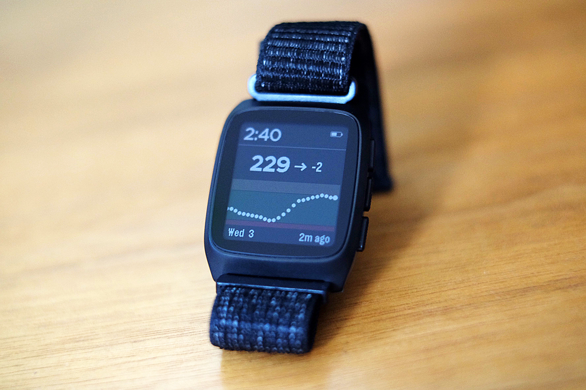
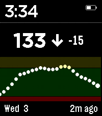

# T1000 Color

A watchface for the Pebble Time 2 that displays real-time Dexcom CGM glucose data and provides configurable High and Low Soon alerts. This is a port of the software written for the [custom T1D smartwatch project](https://andrewchilds.com/posts/building-a-t1d-smartwatch-from-scratch).



## Features



- Current glucose value with trend arrow
- Delta (rate of change)
- Time since last reading
- 2 hour CGM history
- Color-coded chart (green/orange/red for in-range/high/low)
- Supports mg/dL and mmol/L
- Configurable high/low threshold lines
- Configurable high/low alerts
- Shows an alert icon if the watchface loses connection with the iOS companion app.

## Requirements

- Pebble Time 2 (Emery)
- Dexcom CGM with Share enabled
- Dexcom Share account credentials

## Installation Instructions

Install from the Pebble app store:
https://apps.repebble.com/d7c32410f9a44590a63b85ba

## Building

```sh
npm install
```

Build and install locally:

```sh
# pebble clean && pebble build && pebble install --cloudpebble --logs
npm run sideload
```

Run in an emulator:

```sh
# pebble wipe && python3 scripts/inject-emu-settings.py && pebble build && pebble install --emulator emery --logs
npm run emulator
```

## License

MIT
